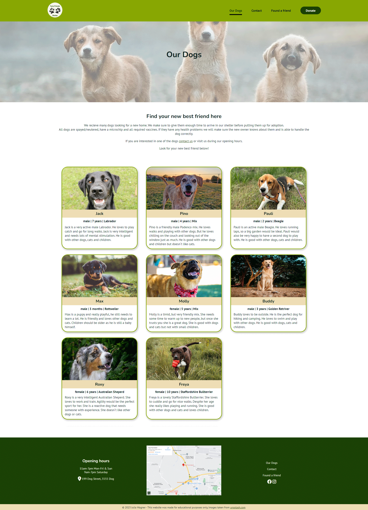
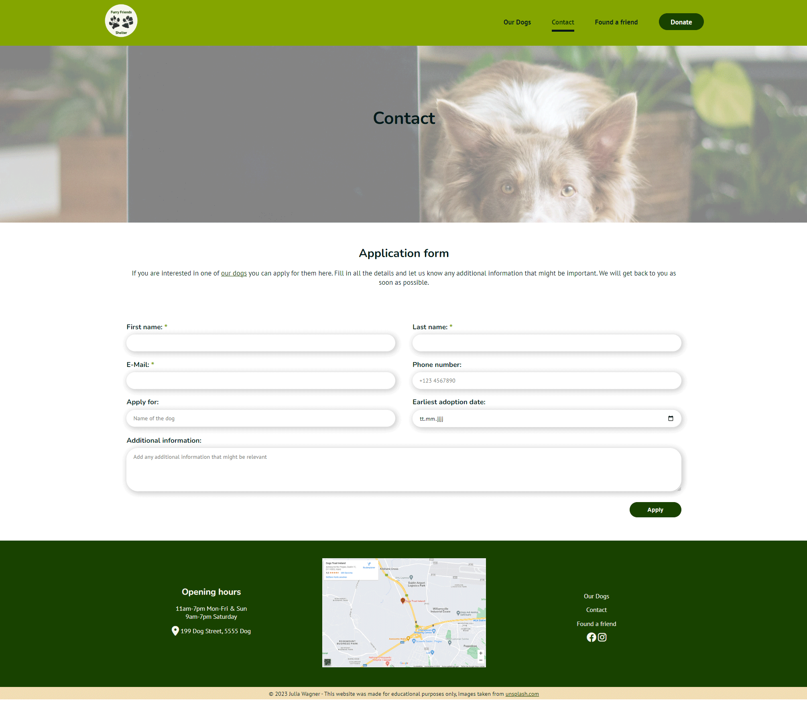

# **Furry Friends Shelter**

## **Planning**
### **External user´s goals:**
- Adopt a dog
- Support the shelter
- Look at cute pictures of dogs

### **Site owner´s goals:**
- Find a new home for the dogs
- Get donations

### **User Stories:**
- As a user, I want to navigate the website using multiple devices.
- As a user, I want to find general information about the shelter
- As a user, I want to find out which dogs are available for adoption.
- As a user, I want to apply for a dog.
- As a user, I want to support the shelter.
- As a user, I want to see pictures of dogs.

- As the site owner, I want to find a loving home for the dogs.
- As the site owner, I want to get donations.

### **Features to achieve the goals:**
- The website will be built with a mobile-first approach, to ensure it is responsive. I will also test it on various devices and screen sizes.
- General information about the shelter like the opening hours and address will be included in the footer.
- The dogs that are available for adoption will be presented on a separate page (*Our Dogs*) with a picture and description of the dog.
- An application form with relevant information will be included on a separate page (*Contact*).
- On a separate page (*Found a friend*) pictures and a video will be included to show the dogs that are already adopted with their new owners.

- Call-to-action buttons will be used throughout the website to get donations. (As the shelter is only imaginative the *Donate* links link to the [PayPal Donations](https://www.paypal.com/donate/buttons/partner) information site and not a real organisation.)

### **Wireframes**
I created wireframes to visualize my ideas using [Balsamiq](https://balsamiq.com/). As I want to stick to the mobile-first approach I created wireframes for mobile, tablet and desktop screen sizes.

- **Mobile Wireframes:**
    - [Home](assets/docs/wireframes/wireframe_mobile_home.png)
    - [Our Dogs](assets/docs/wireframes/wireframe_mobile_our_dogs.png)
    - [Contact](assets/docs/wireframes/wireframe_mobile_contact.png)
    - [Found a friend](assets/docs/wireframes/wireframe_mobile_found_a_friend.png)
    
- **Tablet Wireframes:**
    - [Home](assets/docs/wireframes/wireframe_tablet_home.png)
    - [Our Dogs](assets/docs/wireframes/wireframe_tablet_our_dogs.png)
    - [Contact](assets/docs/wireframes/wireframe_tablet_contact.png)
    - [Found a friend](assets/docs/wireframes/wireframe_tablet_found_a_friend.png)

- **Desktop Wireframes:**
    - [Home](assets/docs/wireframes/wireframe_desktop_home.png)
    - [Our Dogs](assets/docs/wireframes/wireframe_desktop_our_dogs.png)
    - [Contact](assets/docs/wireframes/wireframe_desktop_contact.png)
    - [Found a friend](assets/docs/wireframes/wireframe_desktop_found_a_friend.png)
    
### **Color Scheme**
To create the color scheme I looked at various pictures of dogs I might use as hero images. I quickly decided to go for green as my main color and picked `#83A603` to be one of my main colors. Then I used [coolors.co](https://coolors.co/) to find matching colors for my scheme. After picking out my five main colors I used [contrast-grid.eightshapes.com](https://contrast-grid.eightshapes.com/?version=1.1.0&background-colors=&foreground-colors=%2383a603%0D%0A%231b4001%0D%0A%23f0deb4%0D%0A%23f6f7eb%0D%0A%23001e1d&es-color-form__tile-size=regular&es-color-form__show-contrast=aaa&es-color-form__show-contrast=aa&es-color-form__show-contrast=aa18&es-color-form__show-contrast=dnp) to check the contrast and possible color combinations.

### **Fonts**
I used [fontpair.co](https://www.fontpair.co/) to get some inspiration for possible font pairings. I wanted to use [Google Fonts](https://fonts.google.com/) and decided to use **Nunito** for my headings and **PT Sans** for my text. These two fonts seem to pair nicely and I like the rounded, playful shape of Nunito for the topic of this website.

### **Logo and Images**
After choosing my colors and fonts I wanted to make a simple Logo for my website, as the *Furry Friends Shelter* does not exist in the real world. I used my colors and fonts for the creation of the Logo. The paw prints I used are my own dogs' paws.

## **Features**

### **Header**
To follow my mobile-first approach I started by looking at tutorials on how to implement a hamburger menu without JS. I found a video with the according [Codepen](https://codepen.io/kevinpowell/pen/jxppmr) from Kevin Powell. I used the information from the video and example code in the Codepen for my navigation.
To improve accessibility I added **Menu** as a text alternative and used `aria-hidden` on the hamburger icon.

The navigation header is sticky to improve UX. This way the user can easily navigate the website and click on another page from anywhere. The navigation links have a `:hover` effect that is also used for the active page, as shown in the screenshot below.

Below my navigation, I have a hero image on each page. On the homepage, the hero is bigger than on the other pages. I added an overlay on top of the hero images to make sure that the text is readable.

### **Footer**
The footer includes the shelter´s opening hours, a Google Maps screenshot and links to the site´s pages. The Facebook and Instagram pages are also linked in the Footer.
At the bottom of the footer, I have the copyright information. This includes the disclaimer, that the website was only made for educational purposes and that the images were taken from Unsplash.

In order to create an MVP without JavaScript I only included a screenshot of Google Maps. To further improve the website after this course I would use the [Google Maps API](https://developers.google.com/maps) to add a usable map to the footer.

On bigger screen sizes the footer is organized in three columns using CSS grid. On smaller screens, the elements are presented in one column.

### **Our Dogs Page**
After a heading and some information about the adoption process, all the dogs available for adoption are presented on this page. Each dog is presented as a card with a picture of the dog, their name, facts about them and a short description of their character. 

For the fictional shelter, I created eight dogs available for adoption. On big screen sizes, they are presented in three columns, on smaller sizes there are two columns and for mobile sizes one column.

### **Contact Page**
On the Contact page, the website user finds an application form to apply for one of the shelter´s dogs. The user has to fill out their contact details (required fields are clearly shown with a *) and can give additional information.

### **Found a Friend Page**
The Found a Friend page shows a gallery of former shelter dogs with their new owners. A video is also included in the gallery. Autoplay is turned off for the video to enhance UX. As the shelter is fictional I used a [placeholder video from YouTube](https://www.youtube.com/watch?v=B7yOO4oKMVc&source_ve_path=OTY3MTQ&feature=emb_imp_woyt) that shows a dog being adopted. 

To display the gallery I used CSS grid with column-spans for horizontal content.

## **Testing**
I deployed a first version of my project after finishing the header. From this moment on I made sure to always test my live website. While implementing new features I had the website open in **Google Chrome**, resizing the browser using *Dev Tools*. I also opened the website on my phone after pushing new features. I think you get a better feeling for the mobile version of a website when opening it on a real phone, instead of a smaller browser window. Furthermore, I have **Microsoft Edge** and **Firefox** installed and made sure to open my deployed website there frequently.

To test **Safari** and **iOS** devices I signed up for a free trial on [BrowserStack](https://www.browserstack.com/) as I made a really good experience using this tool before. 

### **Issues**
While coding some issues kept me thinking for longer than others. Below is a list of issues that took me a while to fix.

1. Having a full-width counter section on the Home page.
    - The issue I found while adapting the counter section to desktop screen sizes was that it wasn´t full width on bigger screens.
    
    - This issue appeared because I limited the width of my `main` to `1600px`. I tried fixing this by using `position: absolute;`. However, this led me to another problem as it removed the element from the document flow. So I decided to use `width: 100vw` instead. To then move it to the left side of the screen without positioning it I used a negative margin with `calc()` to calculate it.
    I then noticed a horizontal scrollbar that apparently can appear depending on browser settings when `100vw` is used. So after some more thinking and looking for other hacky solutions I eventually went with the most obvious solution of just removing the `max-width` from my `main`. I decided to use a `.container` class on all the smaller sections instead.
    
    - **Lesson learned** - I´ll think twice before using `100vw` from now on and try to think of obvious solutions instead of hacky ones.

## **Deployment**
I followed my mentor's tip and deployed my website early, after implementing the header. The steps to deploying a website on GitHub pages are:
1. Open the [repository](https://github.com/Julia-Wagner/furry-friends) and go to the **Settings** tab.
2. Navigate to the **Pages** tab in the left menu.
3. Choose **Deploy from a branch** and select the according branch, *main* in my case.
4. Click save. The link to the deployed website can then be found in the [repository](https://github.com/Julia-Wagner/furry-friends) on the right menu under **Environments**.

The link to my live site is: [Furry Friends Shelter](https://julia-wagner.github.io/furry-friends/)

## **Credits**
### **Content**
- I adapted my hamburger menu from a video with the according [Codepen](https://codepen.io/kevinpowell/pen/jxppmr) from Kevin Powell. 
- To test my website I signed up for a free trial on [BrowserStack](https://www.browserstack.com/).

### **Media and Design**
- The images used for the website are taken from [unsplash.com](https://unsplash.com/) and compressed using [tinypng.com](https://tinypng.com/). Some images of dogs are my own pictures.
- I used [Balsamiq](https://balsamiq.com/) to create Wireframes.
- With [coolors.co](https://coolors.co/) I created a color scheme and used [contrast-grid.eightshapes.com](https://contrast-grid.eightshapes.com/?version=1.1.0&background-colors=&foreground-colors=%2383a603%0D%0A%231b4001%0D%0A%23f0deb4%0D%0A%23f6f7eb%0D%0A%23001e1d&es-color-form__tile-size=regular&es-color-form__show-contrast=aaa&es-color-form__show-contrast=aa&es-color-form__show-contrast=aa18&es-color-form__show-contrast=dnp) to check the contrast and possible color combinations.
- [fontpair.co](https://www.fontpair.co/) was used to get inspiration for font pairings, the fonts were downloaded from [Google Fonts](https://fonts.google.com/).